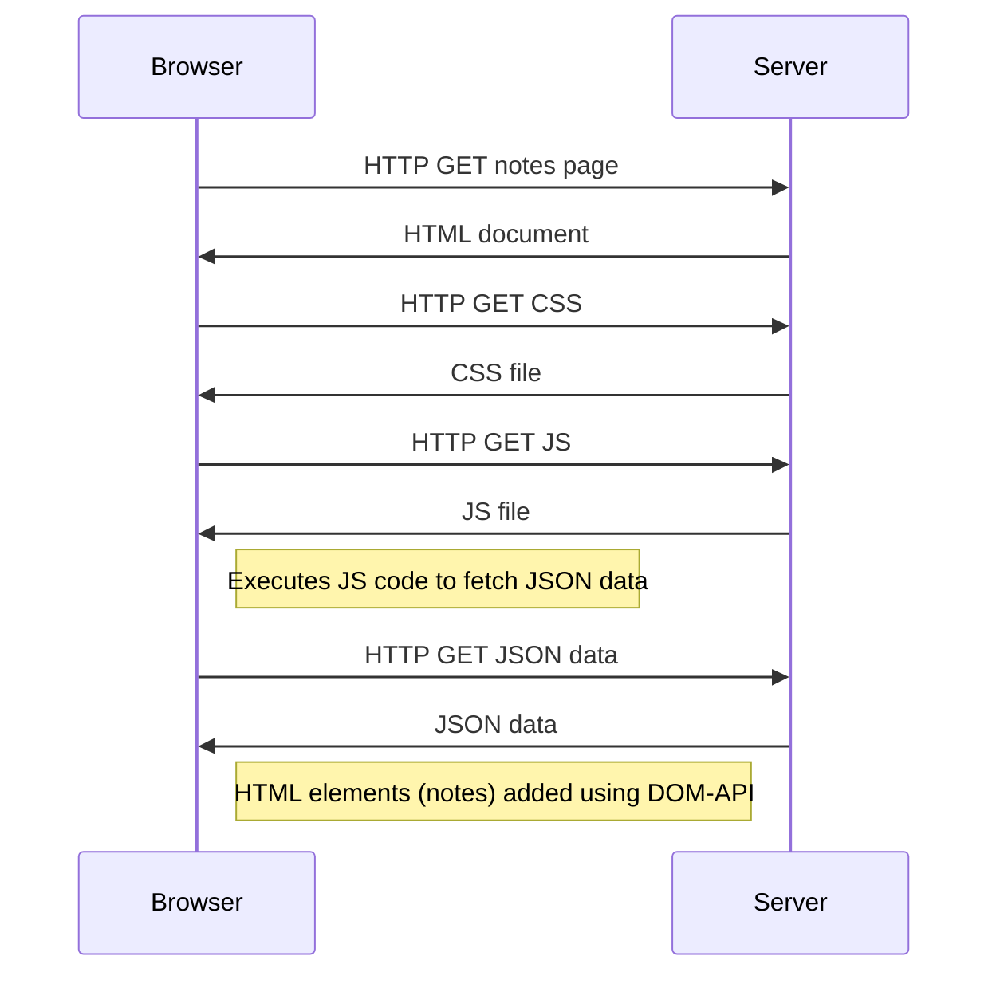

```mermaid
sequenceDiagram
    participant Browser
    participant Server
    Browser->>Server: HTTP GET notes page
    Server->>Browser: HTML document
    Browser->>Server: HTTP GET CSS
    Server->>Browser: CSS file
    Browser->>Server: HTTP GET JS
    Server->>Browser: JS file
    Note right of Browser: Executes JS code to fetch JSON data
    Browser->>Server: HTTP GET JSON data
    Server->>Browser: JSON data
    Note right of Browser: HTML elements (notes) added using DOM-API
```
