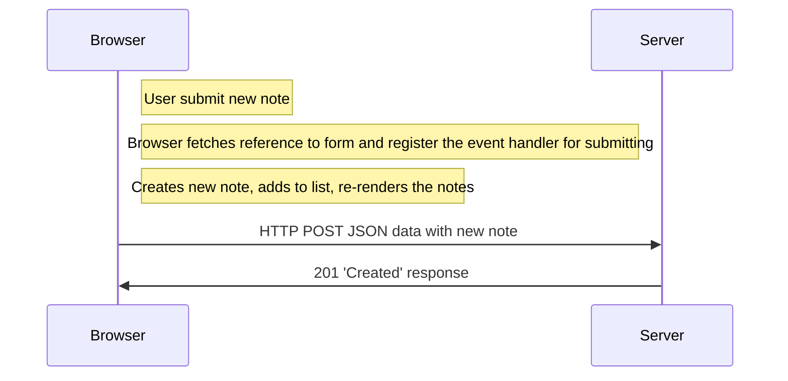

```mermaid
sequenceDiagram
    participant Browser
    participant Server
    Note right of Browser: User submit new note
    Note right of Browser: Browser fetches reference to form and register the event handler for submitting
    Note right of Browser: Creates new note, adds to list, re-renders the notes
    Browser->>Server: HTTP POST JSON data with new note
    Server->>Browser: 201 'Created' response
```
